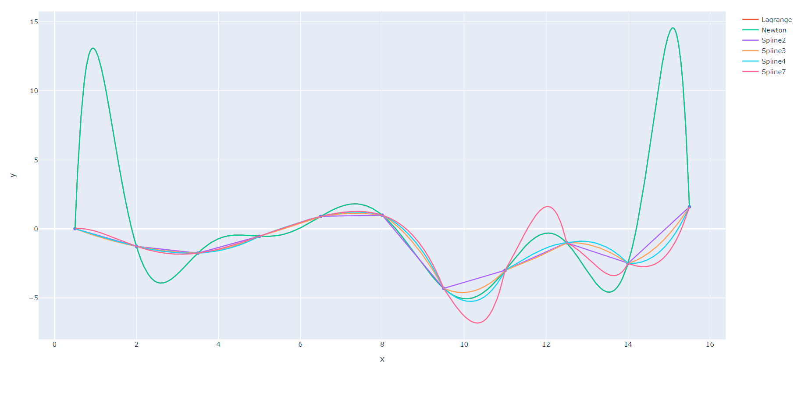
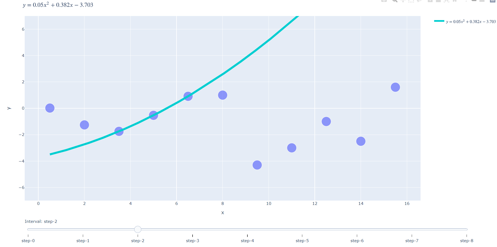
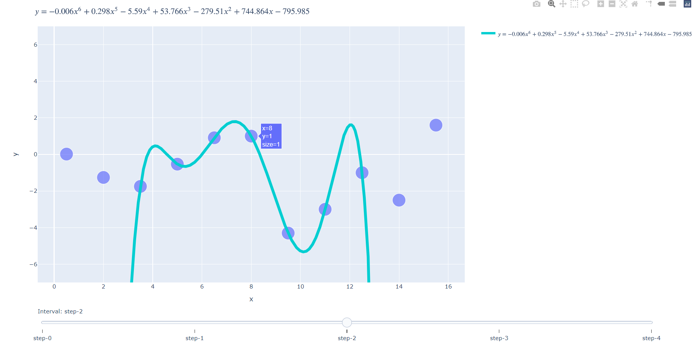
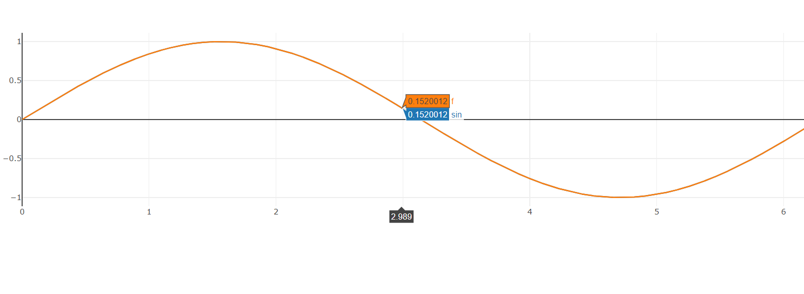
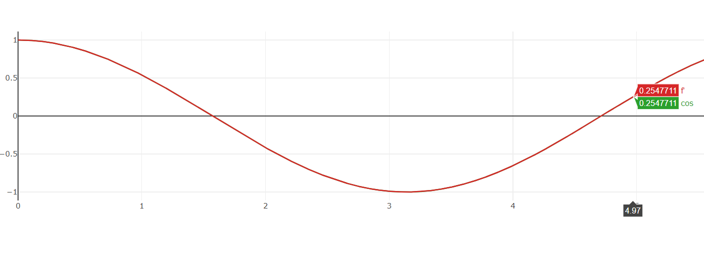
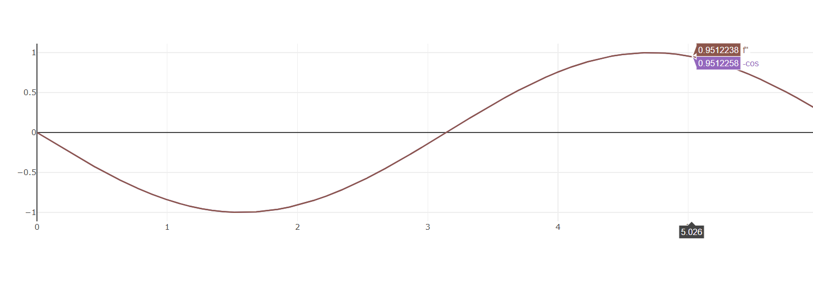
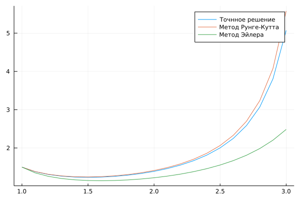

### Лаба 1-2. СЛАУ

### Лаба 3. Интерполирование
#### Численное интерполирование

Сплайны 2 степени

Сплайны 6 степени

#### Численное дифференцирование
Интерполяция

1 Производная

2 Производная

### Лаба 4. Интегрирование
```julia
a, b = 1., 3.

f(x) = x ^ -0.5 * log(x)

true_int = 0.877501 # from wolfram alpha


for (I, method_name) in ((rectangular, "прямоугольников"), (trapezoid, "трапеции"), (simpson, "Симпсона"))
    int, h = integral(f, a, b, I = I)
    local X2 = collect(a:2h:b)

    println("Точность формулы $method_name с шагом h ($(h)) = $(abs(true_int - int))")
    println("Точность формулы $method_name с шагом 2h ($(2h)) = $(abs(true_int - I(f.(X2), 2h)))")
end
```
```
Оптимальный шаг 0.003125 (n = 640) для достижения точности 0.001
Точность формулы прямоугольников с шагом h (0.003125) = 0.0009914388126444074
Точность формулы прямоугольников с шагом 2h (0.00625) = 0.001984737356819699

Оптимальный шаг 0.05 (n = 40) для достижения точности 0.001
Точность формулы трапеции с шагом h (0.05) = 0.00018984083433926102
Точность формулы трапеции с шагом 2h (0.1) = 0.0007598957623364822

Оптимальный шаг 0.0015625 (n = 1280) для достижения точности 0.001
Точность формулы Симпсона с шагом h (0.0015625) = 0.0009909259370938228
Точность формулы Симпсона с шагом 2h (0.003125) = 0.00198268547589997
```
#### Для табличной функции
```julia
X = [0.145, 0.147, 0.149, 0.151, 0.153]
Y = [4.97674, 4.99043, 5.00391, 5.01730, 5.03207]

println("Определенный интеграл от $(X[1]) до $(X[end]) по формуле прямоугольников = ", rectangular(Y, X[2] - X[1]))
println("Определенный интеграл от $(X[1]) до $(X[end]) по формуле трапеций = ", trapezoid(Y, X[2] - X[1]))
println("Определенный интеграл от $(X[1]) до $(X[end]) по формуле симпсона = ", simpson(Y, X[2] - X[1]))
```
```
Определенный интеграл от 0.145 до 0.153 по формуле прямоугольников = 0.039976760000000035
Определенный интеграл от 0.145 до 0.153 по формуле трапеций = 0.040032090000000034
Определенный интеграл от 0.145 до 0.153 по формуле симпсона = 0.03994151333333337
```
### Лаба 5. Диффуры
