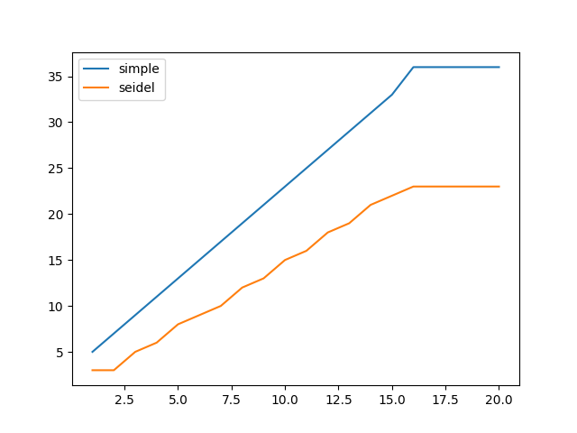

# Метод простых итераций


Пусть система из  уравнений с *n* неизвестными


$$\left\{\begin{array}{c} a_{11} x_{1}+a_{12} x_{2}+\cdots+a_{1 n} x_{n}=b_{1} \\ a_{21} x_{1}+a_{22} x_{2}+\cdots+a_{2 n} x_{n}=b_{2} \\ \vdots \\ a_{m 1} x_{1}+a_{m 2} x_{2}+\cdots+a_{m n} x_{n}=b_{m} \end{array}\right.$$


записана
в векторно-матричной форме<br>


$$Ax = b$$


и приведена к виду


$$x = Cx + f$$


Подставляя начальное приближение


$$x^{(1)}=C x^{(0)}+f$$


и


$$x^{(k+1)}=C x^{(k)}+f, k=0,1,2 \ldots$$


Справедлива следующая оценка абсолютной погрешности k-го приближения


$$\Delta=\left\|x^{(k)}-\bar{x}\right\| \leq \frac{q}{1-q}\left\|x^{(k)}-x^{(k-1)}\right\|$$


<br>


# Метод Зейделя


$\left\{\begin{array}{l} x_{1}^{(k+1)}=c_{11} x_{1}^{(k)}+c_{12} x_{2}^{(k)}+\cdots+c_{1 n} x_{n}^{(k)}+f_{1} \\ x_{2}^{(k+1)}=c_{21} x_{1}^{(k)}+c_{22} x_{2}(k)+\cdots+c_{2 n} x_{n}^{(k)}+f_{2} \\ \vdots \\ x_{n}^{(k+1)}=c_{n 1} x_{1}^{(k)}+c_{n 2} x_{2}^{(k)}+\cdots+c_{n n} x_{n}^{(k)}+f_{n} \end{array}\right.$<div><br></div>


```python
import Solver._
import breeze.linalg._

val C = DenseMatrix(
   (0.06,  0.17, 0.34, 0.16),
   (0.32,  0.23, .0,   -0.35),
   (0.16, -0.08, .0,   -0.12),
   (0.09, 0.21, -0.13, .0)
 )

 val F = DenseVector(2.43, -1.12, 0.43, 0.83)

```


```python
import breeze.numerics.pow
import scala.collection.mutable.ListBuffer

var simpleIters = ListBuffer[Int]()
var seidelIters = ListBuffer[Int]()
var powers = ListBuffer[Int]()


for (power <- 1 to 20) {
    val accuracy = pow(10.0, -power)
    println(s"Accuracy: $accuracy")

    print("Simple iterations: ")
    val (simpleIterations, i1) = Solver.solveDebug(C, F, SolveMethod.SimpleIteration, isReduced = true, accuracy = accuracy, m = 10)

    print("Seidel iterations: ")
    val (seidel, i2) = Solver.solveDebug(C, F, SolveMethod.Seidel, isReduced = true, accuracy = accuracy, m = 10)

    println(simpleIterations)
    println(seidel)

    println(s"Simple accuracy: ${simpleIterations - (C * simpleIterations + F)}")
    println(s"Seidel accuracy: ${seidel - (C * seidel + F)}")

    println()

    simpleIters.append(i1)
    seidelIters.append(i2)
    powers.append(power)
}

val simple = simpleIters.toArray
val seidel = seidelIters.toArray
val pows = powers.toArray

```

    Accuracy: 0.1
    Simple iterations: Seidel iterations: DenseVector(2.9118997340000004, -0.6353494309999999, 0.8451693264, 0.8416449233)
    DenseVector(2.936516515820163, -0.6128955422833706, 0.8447251202953142, 0.855764156905916)
    Simple accuracy: DenseVector(-0.006825605473999907, -0.006451253594999873, -5.651947239999622E-4, -0.007130659818000096)
    Seidel accuracy: DenseVector(0.01038896105377285, 0.007902602296423145, -0.0014574667898715754, 0.0)
    
    Accuracy: 0.01
    Simple iterations: Seidel iterations: DenseVector(2.9215646606906303, -0.6277259262627699, 0.8454548385340801, 0.85067117555149)
    DenseVector(2.936516515820163, -0.6128955422833706, 0.8447251202953142, 0.855764156905916)
    Simple accuracy: DenseVector(-5.778446759623357E-4, -5.147432003129726E-4, -1.330402112635909E-4, -5.380703860545788E-4)
    Seidel accuracy: DenseVector(0.01038896105377285, 0.007902602296423145, -0.0014574667898715754, 0.0)
    
    Accuracy: 0.001
    Simple iterations: Seidel iterations: DenseVector(2.922396007324802, -0.6270962064651961, 0.8455745859911461, 0.8513520528029827)
    DenseVector(2.923290117481523, -0.6264288265672657, 0.8455549660511874, 0.8516239114075568)
    Simple accuracy: DenseVector(-5.3085701069655045E-5, -5.758284109380618E-5, -1.4225361680053616E-5, -4.8688319709278005E-5)
    Seidel accuracy: DenseVector(6.370966664537292E-4, 2.6533494176295136E-4, -9.088950233071547E-5, 0.0)
    
    Accuracy: 1.0E-4
    Simple iterations: Seidel iterations: DenseVector(2.9224746940050466, -0.6270254330582068, 0.8455868558393447, 0.8514157619353995)
    DenseVector(2.922653020815069, -0.6268980324422939, 0.8455814565568878, 0.8514645957080791)
    Simple accuracy: DenseVector(-5.5169104022922966E-6, -5.96885904435851E-6, -1.2384138714516268E-6, -5.3283237164691855E-6)
    Seidel accuracy: DenseVector(1.3447453872039716E-4, 5.2156856439333765E-5, -1.9117883937269653E-5, 0.0)
    
    Accuracy: 1.0E-5
    Simple iterations: Seidel iterations: DenseVector(2.9224828302286214, -0.6270181908635544, 0.8455878600513109, 0.8514226792476481)
    DenseVector(2.9224908262333305, -0.6270125152738744, 0.8455877144008035, 0.8514251432813816)
    Simple accuracy: DenseVector(-5.482353611085955E-7, -5.74901418803897E-7, -1.2654463510397562E-7, -5.335849109222579E-7)
    Seidel accuracy: DenseVector(5.658434594657535E-6, 2.0989929346848513E-6, -8.018246735463919E-7, 0.0)
    
    Accuracy: 1.0E-6
    Simple iterations: Seidel iterations: DenseVector(2.922483637490107, -0.6270174950542124, 0.8455879642913009, 0.8514233664522369)
    DenseVector(2.922485167798736, -0.6270164249658794, 0.8455879236513022, 0.8514237857843823)
    Simple accuracy: DenseVector(-5.309148365384431E-8, -5.693029492270796E-8, -1.3337184801009982E-8, -5.160261895564844E-8)
    Seidel accuracy: DenseVector(1.1502080670133807E-6, 4.2410521139402135E-7, -1.6289963999938095E-7, 0.0)
    
    Accuracy: 1.0E-7
    Simple iterations: Seidel iterations: DenseVector(2.9224837162362918, -0.6270174261015916, 0.8455879753763853, 0.8514234330546173)
    DenseVector(2.922484017590669, -0.6270172171376722, 0.845587965891395, 0.8514235104183676)
    Simple accuracy: DenseVector(-5.2173252385046E-9, -5.724722806910165E-9, -1.3429946044141161E-9, -5.1263845390892016E-9)
    Seidel accuracy: DenseVector(2.3337861954075834E-7, 8.5821407203035E-8, -3.304392170999648E-8, 0.0)
    
    Accuracy: 1.0E-8
    Simple iterations: Seidel iterations: DenseVector(2.9224837240166988, -0.6270174191848732, 0.8455879764810079, 0.8514234396781637)
    DenseVector(2.922483736897458, -0.6270174101594004, 0.8455879761645744, 0.8514234432859025)
    Simple accuracy: DenseVector(-5.149236592671969E-10, -5.703386651845221E-10, -1.3507417406799505E-10, -5.119847878987116E-10)
    Seidel accuracy: DenseVector(9.589008698185353E-9, 3.5201410675256284E-9, -1.3574625867818213E-9, 0.0)
    
    Accuracy: 1.0E-9
    Simple iterations: Seidel iterations: DenseVector(2.9224837247873183, -0.6270174184977758, 0.8455879765914045, 0.851423440338703)
    DenseVector(2.922483727308449, -0.6270174167480242, 0.8455879765148855, 0.8514234409937401)
    Simple accuracy: DenseVector(-5.056888241483648E-11, -5.668310265605214E-11, -1.3744116955649588E-11, -5.074007880523368E-11)
    Seidel accuracy: DenseVector(1.943046612495891E-9, 7.131266688276128E-10, -2.7505953070772193E-10, 0.0)
    
    Accuracy: 1.0E-10
    Simple iterations: Seidel iterations: DenseVector(2.922483724863349, -0.6270174184296325, 0.8455879766026162, 0.851423440404111)
    DenseVector(2.9224837249717055, -0.6270174183533862, 0.8455879766002263, 0.8514234404352129)
    Simple accuracy: DenseVector(-4.96180874165475E-12, -5.649813950014959E-12, -1.3969936318858345E-12, -5.027422922410096E-12)
    Seidel accuracy: DenseVector(7.97677479624781E-11, 2.92714741334521E-11, -1.1291856338857542E-11, 0.0)
    
    Accuracy: 1.0E-11
    Simple iterations: Seidel iterations: DenseVector(2.9224837248708484, -0.6270174184228551, 0.8455879766037517, 0.8514234404105898)
    DenseVector(2.9224837248919378, -0.6270174184081833, 0.8455879766031391, 0.8514234404161478)
    Simple accuracy: DenseVector(-4.871658632055187E-13, -5.634381849972669E-13, -1.4166445794216997E-13, -4.991562718714704E-13)
    Seidel accuracy: DenseVector(1.616173861407333E-11, 5.930589352942661E-12, -2.28783658684506E-12, 0.0)
    
    Accuracy: 1.0E-12
    Simple iterations: Seidel iterations: DenseVector(2.9224837248715887, -0.627017418422181, 0.8455879766038663, 0.8514234404112327)
    DenseVector(2.9224837248725017, -0.6270174184215349, 0.8455879766038489, 0.8514234404115024)
    Simple accuracy: DenseVector(-4.796163466380676E-14, -5.6066262743570405E-14, -1.4432899320127035E-14, -4.951594689828198E-14)
    Seidel accuracy: DenseVector(6.634692795159935E-13, 2.4358293160275934E-13, -9.392486788328824E-14, 0.0)
    
    Accuracy: 1.0E-13
    Simple iterations: Seidel iterations: DenseVector(2.922483724871662, -0.627017418422114, 0.845587976603878, 0.8514234404112966)
    DenseVector(2.9224837248718383, -0.6270174184219908, 0.8455879766038731, 0.8514234404113439)
    Simple accuracy: DenseVector(-4.440892098500626E-15, -5.773159728050814E-15, -1.4432899320127035E-15, -4.884981308350689E-15)
    Seidel accuracy: DenseVector(1.3455903058456897E-13, 4.929390229335695E-14, -1.8984813721090177E-14, 0.0)
    
    Accuracy: 1.0E-14
    Simple iterations: Seidel iterations: DenseVector(2.922483724871669, -0.6270174184221072, 0.8455879766038792, 0.8514234404113029)
    DenseVector(2.9224837248716766, -0.6270174184221018, 0.845587976603879, 0.8514234404113052)
    Simple accuracy: DenseVector(-4.440892098500626E-16, -5.551115123125783E-16, 0.0, -4.440892098500626E-16)
    Seidel accuracy: DenseVector(5.329070518200751E-15, 1.9984014443252818E-15, -7.771561172376096E-16, 0.0)
    
    Accuracy: 1.0E-15
    Simple iterations: Seidel iterations: DenseVector(2.9224837248716695, -0.6270174184221066, 0.8455879766038793, 0.8514234404113035)
    DenseVector(2.9224837248716713, -0.6270174184221056, 0.8455879766038792, 0.8514234404113039)
    Simple accuracy: DenseVector(-4.440892098500626E-16, -1.1102230246251565E-16, 1.1102230246251565E-16, 0.0)
    Seidel accuracy: DenseVector(1.3322676295501878E-15, 2.220446049250313E-16, -2.220446049250313E-16, 0.0)
    
    Accuracy: 1.0E-16
    Simple iterations: Seidel iterations: DenseVector(2.92248372487167, -0.6270174184221065, 0.8455879766038793, 0.8514234404113036)
    DenseVector(2.92248372487167, -0.6270174184221062, 0.8455879766038792, 0.8514234404113037)
    Simple accuracy: DenseVector(0.0, 0.0, 0.0, 0.0)
    Seidel accuracy: DenseVector(0.0, 2.220446049250313E-16, -1.1102230246251565E-16, 0.0)
    
    Accuracy: 1.0E-17
    Simple iterations: Seidel iterations: DenseVector(2.92248372487167, -0.6270174184221065, 0.8455879766038793, 0.8514234404113036)
    DenseVector(2.92248372487167, -0.6270174184221062, 0.8455879766038792, 0.8514234404113037)
    Simple accuracy: DenseVector(0.0, 0.0, 0.0, 0.0)
    Seidel accuracy: DenseVector(0.0, 2.220446049250313E-16, -1.1102230246251565E-16, 0.0)
    
    Accuracy: 1.0E-18
    Simple iterations: Seidel iterations: DenseVector(2.92248372487167, -0.6270174184221065, 0.8455879766038793, 0.8514234404113036)
    DenseVector(2.92248372487167, -0.6270174184221062, 0.8455879766038792, 0.8514234404113037)
    Simple accuracy: DenseVector(0.0, 0.0, 0.0, 0.0)
    Seidel accuracy: DenseVector(0.0, 2.220446049250313E-16, -1.1102230246251565E-16, 0.0)
    
    Accuracy: 1.0E-19
    Simple iterations: Seidel iterations: DenseVector(2.92248372487167, -0.6270174184221065, 0.8455879766038793, 0.8514234404113036)
    DenseVector(2.92248372487167, -0.6270174184221062, 0.8455879766038792, 0.8514234404113037)
    Simple accuracy: DenseVector(0.0, 0.0, 0.0, 0.0)
    Seidel accuracy: DenseVector(0.0, 2.220446049250313E-16, -1.1102230246251565E-16, 0.0)
    
    Accuracy: 1.0E-20
    Simple iterations: Seidel iterations: DenseVector(2.92248372487167, -0.6270174184221065, 0.8455879766038793, 0.8514234404113036)
    DenseVector(2.92248372487167, -0.6270174184221062, 0.8455879766038792, 0.8514234404113037)
    Simple accuracy: DenseVector(0.0, 0.0, 0.0, 0.0)
    Seidel accuracy: DenseVector(0.0, 2.220446049250313E-16, -1.1102230246251565E-16, 0.0)
    
    


```python
import matplotlib.pyplot as plt

fig, ax = plt.subplots()

ax.plot(pows, simple, label='simple')
ax.plot(pows, seidel, label='seidel')
ax.legend()
plt.show()

```


    

    

